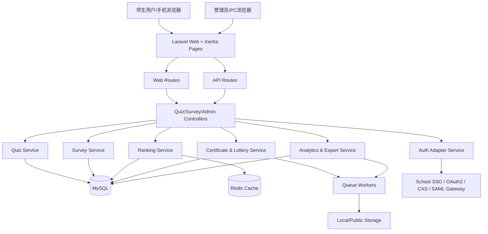

# 数字节·答题挑战赛系统方案

## TL;DR

> **Summary**: 基于现有 Laravel 12 + Inertia + Vue 3 应用扩展一套面向师生的“知识竞赛 + 问卷调查”系统，采用手机端优先的响应式 H5 方案，集成校内统一登录、完整后台、排行榜、证书、奖项分级、抽奖与标准防作弊能力。
> **Deliverables**:
>
> - 需求说明书
> - 系统架构图
> - 模块划分
> - 接口清单
> - 数据库设计
> - 开发排期 / 里程碑
> - 风险点 & 解决方案
> - 测试计划与上线方案
>   **Effort**: Large
>   **Parallel**: YES - 3 waves
>   **Critical Path**: 1 活动与认证基础 → 3 答题会话与防作弊 → 4 排行榜/证书/抽奖 → 9 上线与运维固化

## Context

### Original Request

- 网络安全宣传周，做“数字节·答题挑战赛”
- 面向师生开展数智校园知识竞赛与问卷调查
- 支持手机端自适应
- 需要产出：需求说明书、系统架构图、模块划分、接口清单、数据库设计、开发排期 / 里程碑、风险点 & 解决方案、测试计划、上线方案

### Interview Summary

- 终端形态：响应式 H5 Web，不做原生 App / 小程序首版
- 身份体系：校内统一登录
- 业务流程：答题完成后进入问卷
- 核心机制：排行榜、证书、奖项分级、抽奖
- 管理能力：完整后台（题库、活动配置、问卷、统计导出、看板）
- 防作弊：标准强度（限时、题目乱序、选项乱序、重复提交拦截、设备/IP 频控）
- 规模：校内活动级，数百到数千人

### Metis Review (gaps addressed)

- 将 SSO 协议细节收敛为“接入适配层依赖”，不阻塞整体方案设计
- 明确首版不做多语言、离线模式、原生 App、侵入式监考，防止范围蔓延
- 补充数据一致性要求：成绩结算、排行榜刷新、抽奖资格写入必须使用事务
- 补充审计要求：后台配置变更、奖项发放、证书生成、异常提交均保留日志

## Work Objectives

### Core Objective

在现有 Laravel 12 + Inertia + Vue 3 工程内落地一个手机端优先、后台可运营、支持活动配置与统计复盘的校园知识竞赛系统。

### Deliverables

- 前台活动端：登录、活动首页、答题页、结果页、排行榜、证书页、问卷页、我的记录
- 后台管理端：活动管理、题库管理、试卷策略、问卷管理、用户与成绩查询、奖项/抽奖管理、统计导出、审计日志
- 后端 API：活动、题库、答题、成绩、排行、问卷、证书、抽奖、统计、后台 CRUD
- 数据层：活动、题目、选项、答题会话、提交答案、成绩、排行快照、问卷模板/回答、证书、奖项、抽奖、审计、频控证据
- 运维与交付：测试方案、上线清单、回滚方案、监控告警建议

### Definition of Done (verifiable conditions with commands)

- `php artisan route:list | Select-String -Pattern "quiz|survey|leaderboard|certificate|admin/activities"` 返回新增活动路由
- `php artisan migrate:fresh --seed` 成功建立活动相关表并加载演示数据
- `php artisan test --testsuite=Feature` 包含答题、问卷、排行榜、后台权限用例且全部通过
- `npm run lint` 通过
- `npm run build` 成功打包活动端与后台页面
- 使用 Playwright 覆盖手机视口下的答题主流程与后台管理主流程，证据保存在 `.sisyphus/evidence/`

### Must Have

- 沿用现有 Laravel 12 + Inertia + Vue 3 + Tailwind 技术栈
- 手机端优先的响应式布局
- 校内统一登录接入点
- 活动配置化：题库、活动时间、题量、时长、抽题规则、问卷关联、奖项规则均可后台配置
- 排行榜规则：按总分优先、用时次优先，支持并列处理和刷新缓存
- 证书规则：按达标分数或奖项档位发放
- 抽奖规则：按活动完成状态 / 分数门槛 / 问卷完成状态判定资格
- 标准防作弊：限时、乱序、重复提交拦截、设备/IP 频控、异常日志
- 统计与导出：参与人数、完赛率、平均分、题目正确率、问卷结果、奖项名单

### Must NOT Have (guardrails, AI slop patterns, scope boundaries)

- 不新建第二套前端框架（如 uni-app、React、纯前后端分离 SPA）
- 不首版支持原生 App、小程序、离线答题
- 不实现侵入式监考（摄像头、麦克风、屏幕录制）
- 不把业务逻辑堆进控制器；必须使用 Service / Action / Query 层承载核心规则
- 不允许排行榜实时全表扫描；必须使用缓存或快照策略
- 不允许匿名参与；所有成绩与问卷必须绑定统一身份

## 推荐框架选择

### Primary Recommendation

- **后端**: Laravel 12
- **前端**: Inertia.js + Vue 3 + TypeScript
- **UI / 响应式**: Tailwind CSS
- **认证**: 校内统一登录适配层 + Laravel Session/Auth
- **缓存/队列**: Redis（排行榜缓存、证书生成/导出/抽奖异步任务）
- **数据库**: MySQL / MariaDB（沿用现有 Laravel 主库）
- **自动化测试**: Laravel Feature Test + Playwright（新增）

### Why This Framework

- 与现有仓库完全对齐，复用路由、认证、前端构建、测试与部署链路
- H5 响应式足以满足校园活动传播与手机端访问，不增加小程序/原生端运维成本
- Inertia 可同时承接前台活动页与后台管理页，减少 API/状态同步复杂度
- Laravel 对活动后台、权限、导出、队列、缓存、审计的支撑成熟

### Alternatives Rejected

- **原生 App / uni-app**：研发与发布成本高，不符合活动周期
- **前后端完全分离 SPA + 新后端服务**：重复建设，增加鉴权与部署复杂度
- **纯问卷平台拼装**：难以承接排行榜、证书、抽奖与防作弊闭环

## 需求说明书

### 用户角色

- 学生：参与答题、查看成绩、填写问卷、查看证书/抽奖结果
- 教师：参与答题、查看成绩、填写问卷
- 活动管理员：配置活动、维护题库/问卷、查看统计、导出数据、管理奖项
- 超级管理员：系统配置、SSO 参数、权限分配、审计查看

### 业务流程

1. 用户通过校内统一登录进入活动页
2. 系统校验活动状态、参与资格、是否已提交
3. 用户开始答题，系统创建答题会话并下发试卷
4. 用户提交答卷，系统计算成绩、写入排行、判定证书/奖项/抽奖资格
5. 用户完成问卷调查
6. 用户查看结果页、排行榜、证书下载 / 抽奖状态
7. 管理员在后台查看统计、导出数据、发布获奖名单

### 核心业务规则

- 同一用户同一活动默认仅允许一次正式提交；如需重考，由后台显式重置
- 试卷支持固定卷与随机抽题两种策略
- 题目支持单选、多选、判断
- 成绩结算以服务器时间与服务器评分为准
- 排行榜排序规则：总分 DESC，耗时 ASC，提交时间 ASC
- 问卷完成可作为抽奖资格必要条件
- 证书模板可按活动配置，发放条件可配置

## 系统架构图



## 模块划分

### 前台活动端

- 活动首页模块
- 登录与身份校验模块
- 答题模块
- 成绩结果模块
- 排行榜模块
- 证书模块
- 问卷模块
- 我的记录模块

### 后台管理端

- 活动管理模块
- 题库管理模块
- 试卷策略模块
- 问卷管理模块
- 用户与成绩管理模块
- 排行榜与奖项模块
- 抽奖管理模块
- 统计看板与导出模块
- 系统配置与审计模块

### 基础服务模块

- 统一登录适配模块
- 风控与频控模块
- 缓存与排行快照模块
- 证书生成模块
- 通知/公告模块（可选，首版弱化）

## 接口清单

| 分类     | Method | Path                                              | 说明                       | 鉴权   |
| -------- | ------ | ------------------------------------------------- | -------------------------- | ------ |
| 活动     | GET    | `/api/quiz/activities/current`                    | 获取当前活动配置与状态     | 登录   |
| 活动     | GET    | `/api/quiz/activities/{activity}`                 | 获取活动详情               | 登录   |
| 答题     | POST   | `/api/quiz/activities/{activity}/attempts`        | 创建答题会话               | 登录   |
| 答题     | GET    | `/api/quiz/attempts/{attempt}`                    | 获取会话与题目             | 登录   |
| 答题     | PUT    | `/api/quiz/attempts/{attempt}/answers/{question}` | 保存单题答案               | 登录   |
| 答题     | POST   | `/api/quiz/attempts/{attempt}/submit`             | 提交答卷并结算成绩         | 登录   |
| 结果     | GET    | `/api/quiz/attempts/{attempt}/result`             | 获取成绩、正确率、资格结果 | 登录   |
| 排行     | GET    | `/api/quiz/activities/{activity}/leaderboard`     | 获取排行榜                 | 登录   |
| 证书     | GET    | `/api/quiz/activities/{activity}/certificate`     | 获取证书状态/下载链接      | 登录   |
| 问卷     | GET    | `/api/surveys/activities/{activity}/current`      | 获取活动关联问卷           | 登录   |
| 问卷     | POST   | `/api/surveys/activities/{activity}/responses`    | 提交问卷                   | 登录   |
| 我的记录 | GET    | `/api/me/quiz-records`                            | 获取我的参与记录           | 登录   |
| 后台活动 | GET    | `/api/admin/activities`                           | 活动列表                   | 管理员 |
| 后台活动 | POST   | `/api/admin/activities`                           | 创建活动                   | 管理员 |
| 后台题库 | GET    | `/api/admin/questions`                            | 题库列表                   | 管理员 |
| 后台题库 | POST   | `/api/admin/questions/import`                     | 批量导入题目               | 管理员 |
| 后台问卷 | GET    | `/api/admin/surveys`                              | 问卷列表                   | 管理员 |
| 后台统计 | GET    | `/api/admin/activities/{activity}/analytics`      | 活动统计                   | 管理员 |
| 后台导出 | POST   | `/api/admin/activities/{activity}/exports`        | 发起导出任务               | 管理员 |
| 后台抽奖 | POST   | `/api/admin/activities/{activity}/lottery/draw`   | 执行抽奖                   | 管理员 |

## 数据库设计

### 核心表

| 表名                      | 关键字段                                                                                                                                             | 说明                             |
| ------------------------- | ---------------------------------------------------------------------------------------------------------------------------------------------------- | -------------------------------- |
| `quiz_activities`         | id, title, slug, status, starts_at, ends_at, quiz_duration_seconds, attempt_limit, leaderboard_enabled, certificate_enabled, survey_required         | 活动主表                         |
| `quiz_activity_audiences` | id, activity_id, audience_type, audience_value                                                                                                       | 活动适用人群（学院/身份/年级等） |
| `quiz_questions`          | id, category_id, type, stem, score, difficulty, explanation, is_active                                                                               | 题目                             |
| `quiz_question_options`   | id, question_id, option_key, content, is_correct, sort_order                                                                                         | 选项                             |
| `quiz_papers`             | id, activity_id, generation_mode, question_count, total_score                                                                                        | 试卷策略                         |
| `quiz_paper_questions`    | id, paper_id, question_id, score, sort_order                                                                                                         | 固定卷明细                       |
| `quiz_attempts`           | id, uuid, activity_id, user_id, status, started_at, expires_at, submitted_at, score, duration_seconds, ip_hash, device_fingerprint, anti_cheat_flags | 答题会话                         |
| `quiz_attempt_questions`  | id, attempt_id, question_id, question_order, option_order_json                                                                                       | 会话题目快照                     |
| `quiz_answers`            | id, attempt_id, question_id, answer_payload_json, is_correct, awarded_score, answered_at                                                             | 用户答案                         |
| `quiz_rankings`           | id, activity_id, user_id, score, duration_seconds, rank_no, snapshot_at                                                                              | 排行快照                         |
| `survey_templates`        | id, title, status, version                                                                                                                           | 问卷模板                         |
| `survey_questions`        | id, template_id, type, title, is_required, config_json, sort_order                                                                                   | 问卷题目                         |
| `survey_responses`        | id, activity_id, template_id, user_id, submitted_at                                                                                                  | 问卷作答                         |
| `survey_response_answers` | id, response_id, question_id, answer_json                                                                                                            | 问卷答案                         |
| `quiz_certificates`       | id, activity_id, user_id, template_name, serial_no, issued_at, file_path, eligibility_source                                                         | 证书                             |
| `quiz_rewards`            | id, activity_id, reward_type, reward_name, threshold_rule_json, stock                                                                                | 奖项/奖品配置                    |
| `quiz_reward_records`     | id, reward_id, user_id, source_type, source_id, granted_at, status                                                                                   | 奖项发放记录                     |
| `quiz_lottery_entries`    | id, activity_id, user_id, eligibility_status, source_attempt_id, drawn_at                                                                            | 抽奖资格                         |
| `audit_logs`              | id, actor_id, module, action, target_type, target_id, payload_json, created_at                                                                       | 审计日志                         |
| `rate_limit_evidences`    | id, activity_id, user_id, ip_hash, device_fingerprint, action, blocked_reason, created_at                                                            | 风控证据                         |

### 关键索引

- `quiz_attempts`：`unique(activity_id, user_id)` 防重复正式提交
- `quiz_rankings`：`index(activity_id, score, duration_seconds, submitted_at)` 支撑排行查询
- `survey_responses`：`unique(activity_id, user_id)` 防重复问卷
- `quiz_certificates`：`unique(activity_id, user_id)` 防重复发证
- `quiz_lottery_entries`：`index(activity_id, eligibility_status)` 支撑抽奖筛选

### 数据一致性规则

- 提交答卷、成绩写入、排行榜刷新、证书/抽奖资格判定必须同事务或事务后可靠队列执行
- 排行榜对外查询优先读 Redis 快照，后台定时/事件驱动刷新
- 题目下发后必须保存 attempt 级快照，避免活动进行中题库修改影响已答试卷

## 开发排期 / 里程碑

| 里程碑          | 周期    | 输出                                                |
| --------------- | ------- | --------------------------------------------------- |
| M1 方案冻结     | 第 1 周 | 原型流程、字段字典、接口冻结、数据库评审            |
| M2 基础能力完成 | 第 2 周 | SSO 接入骨架、活动/题库/问卷后台 CRUD、基础前台路由 |
| M3 核心答题闭环 | 第 3 周 | 答题会话、评分、防作弊、结果页                      |
| M4 运营能力完成 | 第 4 周 | 排行榜、证书、奖项、抽奖、统计导出                  |
| M5 联调测试     | 第 5 周 | 全链路测试、压测、修复、上线清单                    |
| M6 正式上线     | 第 6 周 | 灰度/正式发布、监控、活动保障                       |

## 风险点 & 解决方案

| 风险点                   | 影响         | 解决方案                                                       |
| ------------------------ | ------------ | -------------------------------------------------------------- |
| 校内 SSO 协议不明确      | 延迟登录接入 | 抽象 Auth Adapter；先打通本地 mock，待校方提供协议后替换适配器 |
| 排行榜高峰查询压力       | 页面慢/超时  | Redis 缓存 + 排行快照表 + 定时刷新                             |
| 活动期间重复提交/刷题    | 公平性受损   | 唯一约束 + 频控 + 会话过期校验 + 审计日志                      |
| 题库变更影响进行中的答卷 | 成绩争议     | 下发题目时写 attempt 快照                                      |
| 手机端页面复杂导致体验差 | 完赛率下降   | 手机优先设计、单题分页、底部固定操作栏、弱网重试               |
| 抽奖/证书规则临时变更    | 返工         | 将资格规则配置化，后台维护                                     |
| 数据导出卡主请求线程     | 后台不可用   | 导出走队列异步，完成后提供下载链接                             |
| 问卷回收率低             | 数据不足     | 结果页强引导 + 抽奖资格依赖问卷完成                            |

## 测试计划

### 测试范围

- 认证测试：SSO 回调、登录态续期、权限控制
- 功能测试：活动配置、答题、提交、排行、证书、问卷、抽奖、导出
- 异常测试：重复提交、超时提交、弱网重试、活动未开始/已结束、无权限后台访问
- 兼容测试：iPhone / Android 常见视口，微信内置浏览器、Chrome、Edge
- 性能测试：排行榜查询、提交答卷峰值、后台导出任务

### 测试策略

- 后端：Laravel Feature Tests 覆盖 API 与权限
- 前端：Playwright 覆盖关键移动端场景
- 质量门禁：`vendor/bin/pint`、`npm run format`、`npm run lint`、`composer test`、`npm run build`

## 上线方案

### 上线前

- 完成配置清单：SSO 参数、Redis、Queue、存储目录、证书模板、活动数据初始化
- 执行全量迁移与预生产联调
- 完成高峰压测与排行榜缓存预热
- 准备回滚包、数据库备份、活动开关预案

### 上线步骤

1. 发布代码并执行迁移
2. 启动队列与缓存预热任务
3. 导入活动、题库、问卷、奖项配置
4. 开启灰度访问（管理员/小范围师生）
5. 验证核心链路后全量开放

### 回滚方案

- 关闭活动开关并阻止新建答题会话
- 回滚到前一版本代码
- 如迁移有破坏性改动，执行数据库恢复脚本
- 保留已提交答题与问卷数据，不做删除性回滚

## Verification Strategy

> ZERO HUMAN INTERVENTION - all verification is agent-executed.

- Test decision: tests-after + Laravel Feature Test + Playwright
- QA policy: Every task has agent-executed scenarios
- Evidence: `.sisyphus/evidence/task-{N}-{slug}.{ext}`

## Execution Strategy

### Parallel Execution Waves

> Target: 5-8 tasks per wave. <3 per wave (except final) = under-splitting.
> Extract shared dependencies as Wave-1 tasks for max parallelism.

Wave 1: 1 活动与 SSO 基础、2 后台活动/题库/问卷管理、3 答题会话与防作弊基础
Wave 2: 4 排行榜/证书/奖项/抽奖、5 问卷联动、6 前台移动端体验与结果页
Wave 3: 7 统计导出与审计、8 自动化测试与质量门禁、9 上线与运维固化

### Dependency Matrix (full, all tasks)

- 1 → blocks 2,3,4,5,6,7,8,9
- 2 → blocks 3,5,7
- 3 → blocks 4,5,6,7,8,9
- 4 → blocks 7,8,9
- 5 → blocks 7,8
- 6 → blocks 8,9
- 7 → blocks 8,9
- 8 → blocks 9
- 9 → final verification only

### Agent Dispatch Summary (wave → task count → categories)

- Wave 1 → 3 tasks → deep / unspecified-high / quick
- Wave 2 → 3 tasks → deep / visual-engineering / unspecified-high
- Wave 3 → 3 tasks → unspecified-high / quick / deep

## TODOs

> Implementation + Test = ONE task. Never separate.
> EVERY task MUST have: Agent Profile + Parallelization + QA Scenarios.

- [x]   1. 搭建活动域模型、路由骨架与统一登录适配层

    **What to do**: 新增活动域核心模型/迁移/策略对象；建立前台活动路由、后台管理路由、API 路由命名规范；实现 school SSO adapter 接口与本地 mock provider；把登录后的用户身份映射到本地 user/profile 字段，为活动参与、后台权限与统计打基础。
    **Must NOT do**: 不把 CAS/OAuth2/SAML 某一种协议写死到业务控制器；不在首版引入匿名参与。

    **Recommended Agent Profile**:
    - Category: `deep` - Reason: 涉及认证、领域建模、路由约束，是全局基础
    - Skills: `[]` - 无额外技能依赖
    - Omitted: `frontend-design` - 首任务以后端骨架与鉴权为主

    **Parallelization**: Can Parallel: NO | Wave 1 | Blocks: 2,3,4,5,6,7,8,9 | Blocked By: none

    **References** (executor has NO interview context - be exhaustive):
    - Pattern: `routes/web.php:8-26` - 当前 Inertia 页面与 Web 路由组织方式
    - Pattern: `routes/api.php:8-20` - 当前 API 路由与 auth middleware 组织方式
    - Pattern: `resources/js/app.ts:18-38` - Inertia 应用挂载与全局 store 启动方式
    - API/Type: `AGENTS.md:5-16` - 仓库栈与标准命令约束

    **Acceptance Criteria** (agent-executable only):
    - [ ] `php artisan route:list | Select-String -Pattern "quiz.activities|admin.activities|api.quiz.activities.current"` 命中新增路由
    - [ ] `php artisan test --filter=Auth` 覆盖 SSO mock 登录与管理员权限保护用例并通过
    - [ ] `php artisan migrate` 成功创建活动域基础表

    **QA Scenarios** (MANDATORY - task incomplete without these):

    ```
    Scenario: 登录用户成功进入活动首页
      Tool: Playwright
      Steps: 打开 /quiz ; 使用 mock SSO 登录 student1 ; 等待 [data-testid="activity-home"]
      Expected: 页面显示当前活动标题，且 [data-testid="start-quiz-button"] 可点击
      Evidence: .sisyphus/evidence/task-1-auth-foundation.png

    Scenario: 未登录用户访问后台被拦截
      Tool: Playwright
      Steps: 直接访问 /admin/activities
      Expected: 跳转到登录页或 302 到 SSO 入口，不展示后台表格
      Evidence: .sisyphus/evidence/task-1-auth-foundation-error.png
    ```

    **Commit**: YES | Message: `feat(quiz): add activity domain and auth foundation` | Files: `routes/*`, `app/Models/*`, `app/Http/*`, `database/migrations/*`, `resources/js/pages/*`

- [x]   2. 完成后台活动、题库、试卷策略与问卷管理模块

    **What to do**: 实现后台活动 CRUD、题库 CRUD/导入、试卷固定卷与随机卷策略配置、问卷模板与题目配置；提供后台表格、筛选、启停与导出入口；约束管理员权限。
    **Must NOT do**: 不把题目排序/抽题逻辑写死在前端；不遗漏审计日志。

    **Recommended Agent Profile**:
    - Category: `unspecified-high` - Reason: CRUD + 管理台联动较多但难度中等
    - Skills: `[]`
    - Omitted: `frontend-design` - 管理台优先功能完整性，不追求营销视觉

    **Parallelization**: Can Parallel: YES | Wave 1 | Blocks: 3,5,7 | Blocked By: 1

    **References**:
    - Pattern: `routes/web.php:14-24` - 已有 dashboard / inertia 页面入口模式
    - Pattern: `resources/js/router/index.ts:8-50` - 前端路由挂载模式
    - Pattern: `tests/Feature/Api/PostIndexTest.php:14-33` - Feature Test 断言风格

    **Acceptance Criteria**:
    - [ ] `php artisan test --filter=AdminActivity` 覆盖活动 CRUD、权限、状态切换并通过
    - [ ] `php artisan test --filter=QuestionImport` 覆盖题库导入与校验并通过
    - [ ] `npm run build` 后后台管理页成功编译

    **QA Scenarios**:

    ```
    Scenario: 管理员创建活动并配置题库
      Tool: Playwright
      Steps: 登录 admin1 ; 打开 /admin/activities ; 点击 [data-testid="create-activity"] ; 填写活动信息 ; 关联题库 ; 保存
      Expected: 列表出现新活动，状态为“草稿”
      Evidence: .sisyphus/evidence/task-2-admin-crud.png

    Scenario: 普通用户尝试访问题库后台失败
      Tool: Playwright
      Steps: 登录 student1 ; 打开 /admin/questions
      Expected: 返回 403 页面或跳回首页；不显示 [data-testid="question-table"]
      Evidence: .sisyphus/evidence/task-2-admin-crud-error.png
    ```

    **Commit**: YES | Message: `feat(admin): add activity question and survey management` | Files: `app/Http/Controllers/Admin/*`, `resources/js/pages/Admin/*`, `database/migrations/*`

- [x]   3. 实现答题会话、评分结算与标准防作弊闭环

    **What to do**: 创建答题会话、题目快照、单题保存、提交评分、限时过期、重复提交拦截、题目/选项乱序、IP/设备频控、异常日志；结果页返回成绩、排名占位、证书/抽奖资格初判。
    **Must NOT do**: 不允许前端自行计算成绩；不允许提交后再修改答案。

    **Recommended Agent Profile**:
    - Category: `deep` - Reason: 事务、评分、防作弊、数据一致性要求高
    - Skills: `[]`
    - Omitted: `frontend-design` - 先确保规则正确

    **Parallelization**: Can Parallel: YES | Wave 1 | Blocks: 4,5,6,7,8,9 | Blocked By: 1,2

    **References**:
    - Pattern: `routes/api.php:11-20` - 受保护 API 分组模式
    - Pattern: `resources/js/pages/NewsFeed.vue:30-43` - axios 拉取/错误态处理模式
    - Test: `tests/Feature/Api/PostIndexTest.php:19-33` - JSON 结构断言模式

    **Acceptance Criteria**:
    - [ ] `php artisan test --filter=QuizAttempt` 覆盖开始答题、单题保存、提交评分并通过
    - [ ] `php artisan test --filter=QuizAntiCheat` 覆盖超时、重复提交、频控拦截并通过
    - [ ] `curl -i http://127.0.0.1:8000/api/quiz/activities/current` 在登录态下返回活动信息和剩余时间字段

    **QA Scenarios**:

    ```
    Scenario: 学生在时限内完成答题并提交成功
      Tool: Playwright
      Steps: 登录 student1 ; 打开 /quiz ; 点击 [data-testid="start-quiz-button"] ; 回答所有题目 ; 点击 [data-testid="submit-quiz"]
      Expected: 跳转到结果页，显示 [data-testid="score-value"] 与 [data-testid="survey-entry-button"]
      Evidence: .sisyphus/evidence/task-3-quiz-flow.png

    Scenario: 学生重复提交被拦截
      Tool: Playwright
      Steps: 使用已提交账号再次打开 /quiz 并尝试开始答题
      Expected: 显示“已完成本次挑战”提示，不创建第二条 attempt
      Evidence: .sisyphus/evidence/task-3-quiz-flow-error.png
    ```

    **Commit**: YES | Message: `feat(quiz): add attempt scoring and anti-cheat workflow` | Files: `app/Services/Quiz/*`, `app/Http/Controllers/Api/*`, `resources/js/pages/Quiz/*`, `tests/Feature/*`

- [x]   4. 实现排行榜、证书、奖项分级与抽奖资格模块

    **What to do**: 实现排行榜计算与缓存、排行页、证书资格判定与文件生成、奖项档位规则、抽奖资格与后台开奖接口；支持并列名次与奖项名单导出。
    **Must NOT do**: 不允许每次打开排行榜都实时全量重算；不允许证书重复发放。

    **Recommended Agent Profile**:
    - Category: `deep` - Reason: 规则计算 + 缓存 + 异步任务组合复杂
    - Skills: `[]`
    - Omitted: `frontend-design` - 功能正确性优先

    **Parallelization**: Can Parallel: YES | Wave 2 | Blocks: 7,8,9 | Blocked By: 1,3

    **References**:
    - Pattern: `AGENTS.md:10-16` - 质量命令与测试约束
    - API/Type: `routes/api.php:11-20` - 登录态 API 组织模式

    **Acceptance Criteria**:
    - [ ] `php artisan test --filter=Leaderboard` 覆盖排序规则、并列规则、缓存刷新并通过
    - [ ] `php artisan test --filter=Certificate` 覆盖达标发证与防重发并通过
    - [ ] `php artisan test --filter=Lottery` 覆盖资格判定与开奖写入并通过

    **QA Scenarios**:

    ```
    Scenario: 完成答题用户可查看排行榜和证书
      Tool: Playwright
      Steps: 登录 student1 ; 打开 /quiz/result ; 点击 [data-testid="leaderboard-link"] ; 再打开 [data-testid="certificate-link"]
      Expected: 排行页展示当前用户名次；证书页展示下载按钮或已发放状态
      Evidence: .sisyphus/evidence/task-4-ranking-certificate.png

    Scenario: 未达标用户无证书但可见原因
      Tool: Playwright
      Steps: 登录 score-low-user ; 打开 /quiz/certificate
      Expected: 显示“未达到发证条件”，无下载按钮
      Evidence: .sisyphus/evidence/task-4-ranking-certificate-error.png
    ```

    **Commit**: YES | Message: `feat(rewards): add leaderboard certificate and lottery` | Files: `app/Services/Ranking/*`, `app/Jobs/*`, `resources/js/pages/Leaderboard/*`, `resources/js/pages/Certificate/*`

- [x]   5. 实现答题后问卷联动与问卷结果回收模块

    **What to do**: 在结果页强引导进入问卷；实现活动关联问卷模板获取、问卷提交、防重复提交、抽奖资格与问卷完成状态联动；后台可查看问卷汇总与单条回答。
    **Must NOT do**: 不允许问卷提交覆盖已提交记录；不允许未完成答题用户直接提交活动问卷。

    **Recommended Agent Profile**:
    - Category: `unspecified-high` - Reason: 业务规则明确，联动点多
    - Skills: `[]`
    - Omitted: `frontend-design` - 以流程闭环为主

    **Parallelization**: Can Parallel: YES | Wave 2 | Blocks: 7,8 | Blocked By: 1,2,3

    **References**:
    - Pattern: `resources/js/pages/NewsFeed.vue:49-91` - 页面状态展示与空态/错误态模式
    - Test: `tests/Feature/Api/PostIndexTest.php:21-32` - API 结构断言模式

    **Acceptance Criteria**:
    - [ ] `php artisan test --filter=SurveyFlow` 覆盖答题后进入问卷、提交成功并通过
    - [ ] `php artisan test --filter=SurveyDuplicate` 覆盖重复提交问卷被拦截并通过
    - [ ] `curl -i http://127.0.0.1:8000/api/surveys/activities/1/current` 在登录且已完成答题时返回问卷结构

    **QA Scenarios**:

    ```
    Scenario: 用户答题结束后完成问卷
      Tool: Playwright
      Steps: 登录 student1 ; 打开 /quiz/result ; 点击 [data-testid="survey-entry-button"] ; 完成问卷 ; 点击 [data-testid="submit-survey"]
      Expected: 显示“问卷提交成功”，结果页抽奖状态更新为“已获得资格”
      Evidence: .sisyphus/evidence/task-5-survey-flow.png

    Scenario: 未答题用户直达问卷页失败
      Tool: Playwright
      Steps: 登录 student2 ; 直接访问 /survey/current
      Expected: 返回提示“请先完成答题挑战”
      Evidence: .sisyphus/evidence/task-5-survey-flow-error.png
    ```

    **Commit**: YES | Message: `feat(survey): add post-quiz survey workflow` | Files: `app/Services/Survey/*`, `resources/js/pages/Survey/*`, `tests/Feature/*`

- [x]   6. 完成前台手机端页面、自适应交互与结果页体验

    **What to do**: 设计手机端优先页面结构；实现活动首页、答题单题分页、顶部进度、底部固定操作栏、结果页、排行榜页、证书页、自适应空态/错误态/弱网提示；兼顾 PC 浏览器后台。
    **Must NOT do**: 不允许沿用桌面端固定宽度布局；不允许关键 CTA 在手机端折叠不可见。

    **Recommended Agent Profile**:
    - Category: `visual-engineering` - Reason: 核心是移动端信息层级与交互体验
    - Skills: [`frontend-design`] - 需要高质量响应式界面方案
    - Omitted: `[]` - 无

    **Parallelization**: Can Parallel: YES | Wave 2 | Blocks: 8,9 | Blocked By: 1,3

    **References**:
    - Pattern: `resources/js/app.ts:25-33` - Vue app/store 装配方式
    - Pattern: `resources/js/router/index.ts:34-49` - 页面标题与路由切换模式
    - Pattern: `resources/js/pages/NewsFeed.vue:50-91` - 现有 Tailwind 组件风格基础

    **Acceptance Criteria**:
    - [ ] `npm run build` 编译通过且无 TypeScript 错误
    - [ ] Playwright 在 `iPhone 12` 与 `Pixel 7` 视口下完成答题闭环
    - [ ] 关键页面存在 `data-testid="activity-home"|"quiz-question-card"|"quiz-result"|"leaderboard-page"`

    **QA Scenarios**:

    ```
    Scenario: iPhone 12 视口下顺畅完成答题流程
      Tool: Playwright
      Steps: 以 iPhone 12 视口打开 /quiz ; 完成 5 道题切换和提交
      Expected: 所有按钮可见可点，无横向滚动，结果页首屏展示成绩
      Evidence: .sisyphus/evidence/task-6-mobile-ui.png

    Scenario: 弱网下页面显示重试提示
      Tool: Playwright
      Steps: 模拟 Slow 3G ; 打开 /quiz/leaderboard
      Expected: 出现加载态；接口失败时显示“点击重试”按钮
      Evidence: .sisyphus/evidence/task-6-mobile-ui-error.png
    ```

    **Commit**: YES | Message: `feat(ui): add responsive quiz and survey experience` | Files: `resources/js/pages/Quiz/*`, `resources/js/pages/Survey/*`, `resources/js/components/*`

- [x]   7. 完成统计看板、导出任务与审计日志模块

    **What to do**: 实现活动统计（参与人数、完赛率、平均分、题目正确率、问卷回收率、证书发放数、抽奖人数）、后台看板、CSV/Excel 导出任务、审计日志列表与详情。
    **Must NOT do**: 不在同步请求里生成大文件；不遗漏后台关键操作日志。

    **Recommended Agent Profile**:
    - Category: `unspecified-high` - Reason: 统计/导出/审计需要多处整合但规则稳定
    - Skills: `[]`
    - Omitted: `frontend-design` - 看板以信息准确为先

    **Parallelization**: Can Parallel: YES | Wave 3 | Blocks: 8,9 | Blocked By: 1,2,3,4,5

    **References**:
    - Pattern: `AGENTS.md:12-16` - 现有测试与质量命令
    - Pattern: `routes/api.php:11-20` - 受保护接口模式

    **Acceptance Criteria**:
    - [ ] `php artisan test --filter=Analytics` 覆盖统计聚合接口并通过
    - [ ] `php artisan test --filter=Export` 覆盖导出任务入队与下载链接生成并通过
    - [ ] `php artisan test --filter=AuditLog` 覆盖后台操作写审计日志并通过

    **QA Scenarios**:

    ```
    Scenario: 管理员查看活动统计并发起导出
      Tool: Playwright
      Steps: 登录 admin1 ; 打开 /admin/activities/1/analytics ; 点击 [data-testid="export-results"]
      Expected: 页面出现“导出任务已创建”，任务列表状态为处理中/已完成
      Evidence: .sisyphus/evidence/task-7-analytics-export.png

    Scenario: 普通用户无法访问统计看板
      Tool: Playwright
      Steps: 登录 student1 ; 打开 /admin/activities/1/analytics
      Expected: 返回 403 或跳回首页
      Evidence: .sisyphus/evidence/task-7-analytics-export-error.png
    ```

    **Commit**: YES | Message: `feat(admin): add analytics exports and audit logs` | Files: `app/Services/Analytics/*`, `app/Jobs/*`, `resources/js/pages/Admin/Analytics/*`

- [x]   8. 补齐自动化测试、质量门禁与关键回归用例

    **What to do**: 为活动链路增加 Laravel Feature Tests、必要的服务层测试与 Playwright E2E；把 lint、format、test、build 固化到 CI；补充种子数据与可复用测试工厂。
    **Must NOT do**: 不只测 happy path；不允许关键路径无移动端回归。

    **Recommended Agent Profile**:
    - Category: `quick` - Reason: 以测试补齐与流水线固化为主，边界清晰
    - Skills: `[]`
    - Omitted: `frontend-design` - 非 UI 设计任务

    **Parallelization**: Can Parallel: YES | Wave 3 | Blocks: 9 | Blocked By: 3,4,5,6,7

    **References**:
    - Test: `tests/Feature/Api/PostIndexTest.php:14-33` - 当前 Laravel Feature Test 模式
    - Pattern: `AGENTS.md:12-16` - 命令基线：composer test / npm run format / npm run lint

    **Acceptance Criteria**:
    - [ ] `composer test` 全部通过
    - [ ] `npm run format -- --check` 通过
    - [ ] `npm run lint` 通过
    - [ ] `npm run build` 通过

    **QA Scenarios**:

    ```
    Scenario: CI 本地全量质量门禁通过
      Tool: Bash
      Steps: 依次运行 vendor/bin/pint ; npm run format -- --check ; npm run lint ; composer test ; npm run build
      Expected: 全部命令退出码为 0
      Evidence: .sisyphus/evidence/task-8-quality-gates.txt

    Scenario: 关键回归发现重复提交缺陷时测试失败
      Tool: Bash
      Steps: 人为注释重复提交唯一约束测试并重新运行 php artisan test --filter=QuizAntiCheat
      Expected: 用例失败，证明回归可被测试捕获
      Evidence: .sisyphus/evidence/task-8-quality-gates-error.txt
    ```

    **Commit**: YES | Message: `test(quiz): add feature e2e and quality gates` | Files: `tests/Feature/*`, `tests/Playwright/*`, `.github/workflows/*`

- [x]   9. 固化上线脚本、活动开关、监控与回滚预案

    **What to do**: 增加环境配置说明、活动开关、缓存预热命令、排行榜刷新任务、导出/证书队列 worker 配置、监控指标与告警阈值、上线检查清单与回滚说明。
    **Must NOT do**: 不依赖人工口头流程；不在无回滚预案的情况下发布活动。

    **Recommended Agent Profile**:
    - Category: `deep` - Reason: 涉及运维流程、发布稳定性与风险收敛
    - Skills: `[]`
    - Omitted: `frontend-design` - 无界面设计需求

    **Parallelization**: Can Parallel: YES | Wave 3 | Blocks: none | Blocked By: 1,3,4,6,7,8

    **References**:
    - Pattern: `AGENTS.md:10-16` - 仓库标准 setup/dev/test 命令
    - Pattern: `routes/web.php:14-24` - 前后台入口路由风格

    **Acceptance Criteria**:
    - [ ] `php artisan schedule:list` 包含排行榜刷新/清理任务
    - [ ] `php artisan queue:work --once` 可消费证书/导出任务
    - [ ] `.env.example` 或部署文档包含 SSO / Redis / Queue / Storage 必要配置

    **QA Scenarios**:

    ```
    Scenario: 预发布环境按脚本完成预热和健康检查
      Tool: Bash
      Steps: 运行 migrate ; queue worker once ; cache warmup ; 健康检查脚本
      Expected: 所有命令成功；/quiz 首页与 /admin/activities 可访问
      Evidence: .sisyphus/evidence/task-9-release-ops.txt

    Scenario: 关闭活动开关后新用户不能开始答题
      Tool: Playwright
      Steps: 管理员关闭活动 ; 学生访问 /quiz
      Expected: 首页显示“活动未开放”，无开始按钮
      Evidence: .sisyphus/evidence/task-9-release-ops-error.png
    ```

    **Commit**: YES | Message: `chore(release): add launch runbook and operational safeguards` | Files: `app/Console/*`, `config/*`, `docs/*`, `.env.example`

## Final Verification Wave (MANDATORY — after ALL implementation tasks)

> 4 review agents run in PARALLEL. ALL must APPROVE. Present consolidated results to user and get explicit "okay" before completing.
> **Do NOT auto-proceed after verification. Wait for user's explicit approval before marking work complete.**
> **Never mark F1-F4 as checked before getting user's okay.** Rejection or user feedback -> fix -> re-run -> present again -> wait for okay.

- [x] F1. Plan Compliance Audit — oracle
- [x] F2. Code Quality Review — unspecified-high
- [x] F3. Real Manual QA — unspecified-high (+ playwright if UI)
- [x] F4. Scope Fidelity Check — deep

## Commit Strategy

- 每个 TODO 单独提交，避免大而全提交
- 后台 CRUD 与前台用户链路分开提交，便于回滚
- 测试补齐与 CI 固化独立提交，保证回归可识别

## Success Criteria

- 师生可通过校内统一登录完成一次完整的答题 → 成绩 → 问卷 → 证书/抽奖流程
- 管理员可独立配置活动、题库、问卷、奖项并导出统计
- 手机端主流程在常见视口下可无阻塞完成
- 排行榜、证书、抽奖资格与统计结果一致且可追溯
- 全部质量门禁与关键自动化测试通过
